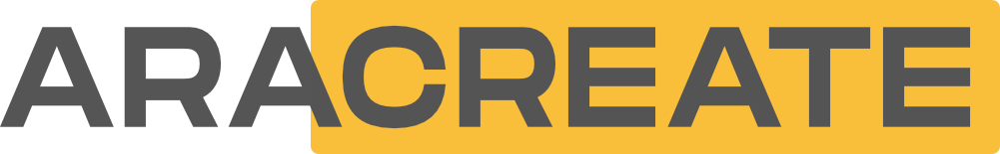

<!--
════════════════════════════════════════════════════════════════════════
  araCreate Group — GitHub organisation landing page
  ────────────────────────────────────────────────────────────────────
  REPO   : github.com/aracreate-group/.github   (must be PUBLIC)
  PATH   : profile/README.md                    (GitHub-mandated path)
  RENDERS: https://github.com/aracreate-group

  Design system: claude.ai/design "aracreate-design-system" (Brand
  Guidelines v1.0, 2026). Palette is intentionally tight —
    Golden Sun    #F9BF3B  brand / accent (CTAs, highlights)
    Black         #222222  headings, dark bands, badge labelColor
    Graphite Gray #555555  primary text / secondary brand
    Stroke        #CECECE  hairline borders
    Canvas        #F6F6F6  off-white background
  Do NOT introduce hues outside this palette (a brand guideline don't).
  Type is Poppins (headings/body) + Monument Extended (wordmark only).
  No emoji — the brand never uses them. Logo must stay PNG: GitHub serves
  raw .svg as text/plain, so SVG will not render in an .

  Copy is sourced verbatim from the araCreate Deck (04.02.2026) in Canva —
  story, verticals, service domains, values, ecosystem and contact.
════════════════════════════════════════════════════════════════════════
-->

### Empowering ideas from mind to market with 360° services in Engineering, Manufacturing and Media

---
**01 — ARACREATE GROUP**

## Where boundless passion meets performing results …

Founded in **2003** by [Aravinth Panch](https://github.com/AravinthPanch), araCreate has evolved from a solo digital studio into a thriving group of companies across **Europe and Asia**, operating as an interdisciplinary ecosystem delivering **360° services**.

We empower ideas from mind to market — whether it is crafting cutting-edge hardware and software technologies, manufacturing industrial products, creating immersive media experiences, or delivering performance marketing campaigns.

With a proven track record, we have empowered **300+ clients** — from small and medium businesses and social enterprises to unicorn startups, global corporations and government organisations — across diverse industries.

 

| 300+ | 60+ | 8+ | 3+ | 3+ | 50+ | 50+ | 20+ |
| :---: | :---: | :---: | :---: | :---: | :---: | :---: | :---: |
| Clients | New products | Group companies | Service verticals | Country offices | Service capabilities | Team members | Years |

**TRUSTED BY**

LAMY · Deutsche Telekom · Miele · Gira · Phoenix Contact · infarm 
Senic · metr · German Autolabs · Playmobil · Poggenpohl · Overtone

[See all clients →](https://aracreate.group/lists/clients)

---
**02 — SERVICES**

## Where complex ideas need broader services …

| Vertical | Service domains |
| :--- | :--- |
| **[Engineering](https://aracreate.group/engineering)** Prototype → Production | **Hardware** — industrial design, mechanical, DFM, electronics, RF, embedded, firmware, BSP **Software** — fullstack, apps, web, cloud, UI/UX, AI/ML, data science, DevOps, digital transformation |
| **[Manufacturing](https://aracreate.group/manufacturing)** Drawing → Delivery | **Production** — rapid prototyping, series production, electronics, plastics, metal, wood **Operations** — sourcing, certifications, assembly, packaging, logistics |
| **[Media](https://aracreate.group/media)** Sketch → Screen | **Multimedia** — graphics, branding, logo, print, video, photo, animation, VFX **Marketing** — social media, content creation, advertising, analytics, market research, SEO |

---
**03 — VALUES**

## Where genuine values shape work ethics …

- **We pursue excellence.** We take pride in each project, regardless of size — our passion fuels innovation and creativity.
- **We collaborate seamlessly.** We combine expertise across disciplines and verticals to deliver comprehensive solutions.
- **We deliver results.** We focus on the outcomes that matter most, delivering measurable impact and tangible success.
- **We stay curious.** We pioneer new approaches across industries, keeping clients ahead of emerging trends.

---
**04 — ECOSYSTEM**

## Where a group of companies delivers unified global solutions …

| Country | Companies |
| :--- | :--- |
| **Germany** | araCreate GmbH · BatchOne GmbH · rlgtechdesign GmbH · DreamSpace Foundation gUG |
| **India** | araCreate India Pvt Ltd · Micro-Tech CNC Pvt Ltd |
| **Sri Lanka** | araCreate Lanka Pvt Ltd · DreamSpace Foundation CLG |

---
**05 — ORGANISATION**

## What lives here

Source code, hardware projects, tooling and the internal references maintained by araCreate Group and its teams.

| Repository | Purpose |
| :--- | :--- |
| **[aracreate-conventions](https://github.com/aracreate-group/aracreate-conventions)** | The canonical reference every araCreate repository follows |
| **[aracreate-guidelines](https://github.com/aracreate-group/aracreate-guidelines)** | Code of conduct, best practices and co-creation methodology |
| **[eval-nrf54h20dk](https://github.com/aracreate-group/eval-nrf54h20dk)** | Nordic nRF54H20 evaluation and board bring-up |
| **[ac-asset-manager](https://github.com/aracreate-group/ac-asset-manager)** | Infrastructure and asset management tooling |
| **[aracreate-interview-template](https://github.com/aracreate-group/aracreate-interview-template)** | Starting point for candidate assignments |

<a href="https://github.com/orgs/aracreate-group/repositories">Browse all repositories →</a>
 

> [!NOTE]
> Most of our work is confidential new product development — from concept to commercial launch. Case studies are shared only once clients reach market success and grant public disclosure. Client work lives in private repositories; what you see here is what we can share openly.
>
> For our full capabilities and selected case studies, see the **[araCreate deck](https://deck.aracreate.group/)**.

---
**06 — GET STARTED**

## Start here

Read **[aracreate-conventions](https://github.com/aracreate-group/aracreate-conventions)** — naming, branching, commits, licensing, repository structure.

**Conventions at a glance**

<!-- Kept in sync with aracreate-conventions rather than restating it, so the two can never drift apart. -->

| | |
| :--- | :--- |
| Repository naming | `param-case` — lowercase, hyphen-separated (e.g. `client-product-project`) |
| Default branch | `main` |
| Commit messages | Conventional Commits — `feat:` · `fix:` · `chore:` · `refactor:` · `docs:` |
| Licence | Proprietary by default; copyright held by the IP owner (araCreate Group, or the client for client work) |
| Every repo ships | `README.md` · `LICENSE` · `.gitignore` · `Makefile` · `VERSION` |

 

---

### No detail is too intricate. No project is too small.

Whether it is cutting-edge hardware and software, industrial manufacturing, immersive media or performance marketing — we take ideas from mind to market.

 

 

© araCreate Group · All rights reserved · Germany · India · Sri Lanka | <a href="https://aracreate.group/etc/imprint">Imprint</a> · <a href="https://aracreate.group/etc/privacy-policy">Privacy Policy</a> · <a href="https://aracreate.group/etc/code-of-conduct">Code of Conduct</a>

